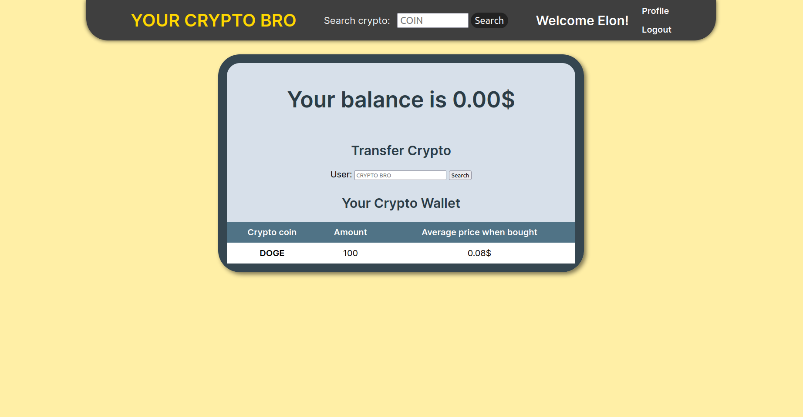

# "Your Crypto Bro"

## General info

This project is cryptocurrency trading website for:

* Checking the current price of cryptocurrencies.
* Buying, selling and shorting cryptocurrencies.
* Build your own portfolio.
* See your transaction history for specific cryptocurrencies.
* Send and receive cryptocurrencies to other users.
* Everything mentioned is validated.

## Technologies used

* PHP 7.4
* MySQL 8.0
* Composer 2.4

## Setup

1. Clone this repository using the following command: `git clone https://github.com/MarisSuss/your-crypto-bro`.
2. Install all the dependencies using the following command: `composer install`.
3. Create a database and import the `your-crypto-bro.sql` file.
4. Rename the `.env.example` file to `.env` and fill in the required fields.
5. Run the following command: `php -S localhost:8000 -t public`.

## Showcase

    <h4>
        Register and Login
    </h4>
    
    <h4>
        Trade
    </h4>
    
    <h4>
        Transfer crypto coins to other user
    </h4>
    
    <h4>
        Portfolio after transfer
    </h4>
    

